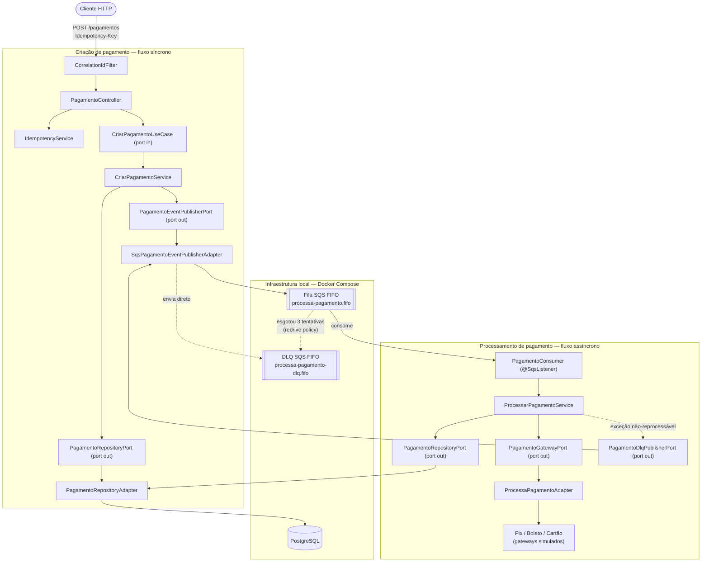

# processa-pagamento

Aplicação de processamento de pagamentos construída em Kotlin + Spring Boot, seguindo arquitetura hexagonal (Ports & Adapters), com persistência em PostgreSQL e mensageria assíncrona via fila SQS FIFO (emulada localmente com LocalStack).

---

## Arquitetura

A aplicação é dividida em dois módulos hexagonais independentes, que só se comunicam através da fila SQS — não há chamada direta em memória entre eles:

- **Criação de pagamento** (fluxo síncrono): recebe a requisição HTTP, garante idempotência, persiste o pagamento e publica o evento na fila.
- **Processamento de pagamento** (fluxo assíncrono): consome o evento da fila, chama o gateway de pagamento correspondente e registra o resultado.

Em ambos, o domínio (casos de uso e portas) não depende de Spring, JPA ou AWS SDK — essas dependências ficam isoladas nos adapters, de acordo com o padrão Ports & Adapters.



**Como ler o diagrama:**

- `PagamentoRepositoryPort` e `SqsPagamentoEventPublisherAdapter` aparecem em ambos os fluxos porque são reutilizados pelos dois módulos — o adapter de persistência atende tanto a criação (`salvarPagamento`) quanto o processamento (`buscarComHistorico`/`adicionarStatus`), e o mesmo adapter de mensageria publica tanto na fila principal quanto na DLQ (implementa `PagamentoEventPublisherPort` e `PagamentoDlqPublisherPort`).
- A seta pontilhada de `ProcessarPagamentoService` para a DLQ representa o desvio manual feito para exceções de negócio não reprocessáveis (dado inconsistente); a seta pontilhada de `Queue` para `Dlq` representa o redrive automático do próprio SQS após esgotar as tentativas — dois caminhos distintos para a mesma fila de destino.
- `PagamentoConsumer` e `ProcessaPagamentoAdapter` (gateways de Pix/Boleto/Cartão) ficam fora do fluxo de persistência principal, mas dependem de `PagamentoRepositoryPort` para checar idempotência e registrar o resultado do processamento.

---

## Decisões técnicas e arquiteturais

Este é um resumo das principais decisões tomadas ao longo do desenvolvimento, com a justificativa de cada uma.

### Arquitetura da aplicação

Optou-se por arquitetura hexagonal em vez de uma estrutura em camadas tradicional. O domínio (entidades e regras de negócio) fica isolado de qualquer detalhe de infraestrutura — não conhece JPA, Spring, AWS SDK ou HTTP. A comunicação entre domínio e mundo externo acontece por meio de portas de entrada (casos de uso) e portas de saída (persistência, mensageria, gateways externos), implementadas por adapters. Essa escolha visa permitir trocar qualquer peça de infraestrutura (por exemplo, banco de dados ou provedor de fila) sem alterar a lógica de negócio.

### Infraestrutura local via Docker

Todo o ambiente de desenvolvimento sobe via `docker-compose`, contendo dois serviços: PostgreSQL (banco de dados) e LocalStack (emulação de serviços AWS, usado aqui exclusivamente para SQS). Isso evita dependência de conta AWS real durante o desenvolvimento e testes.

### Controle de schema do banco: Hibernate `ddl-auto=update`

Avaliou-se o uso do Flyway para versionamento de schema, mas, por se tratar de um projeto de teste/estudo, optou-se por deixar o Hibernate gerenciar a criação e atualização das tabelas automaticamente. Essa escolha reduz a complexidade de manutenção às custas de não ter histórico versionado de mudanças de schema — uma troca aceitável no estágio atual do projeto, mas que deve ser revista caso o projeto evolua para um cenário de produção.

### Relacionamento entre Pagamento e Histórico de Status

O relacionamento entre a entidade de pagamento e o histórico de status foi modelado como **unidirecional** (apenas o lado do status referencia o pagamento, via chave estrangeira), em vez de bidirecional com coleção `@OneToMany`. A decisão evita os problemas comuns de coleções gerenciadas pelo Hibernate (consultas N+1, exceções de carregamento tardio fora de contexto transacional, necessidade de listas mutáveis) e mantém as entidades de persistência mais simples. Quando a aplicação precisa consultar um pagamento junto com seu histórico completo, essa composição é feita explicitamente na camada de adapter, combinando duas consultas simples — evitando também duplicidade de linhas que ocorreria com `JOIN FETCH` direto sobre uma coleção.

Pela mesma razão, ao adicionar um novo status a um pagamento já existente, a aplicação não carrega o pagamento inteiro em memória — usa-se uma referência (proxy) apenas com o identificador, suficiente para satisfazer a chave estrangeira na inserção do novo registro de status.

### Idempotência na criação de pagamentos

Para evitar que retentativas do cliente (timeout, falha de rede, duplo clique) resultem em pagamentos duplicados, foi implementado o padrão de **chave de idempotência** («Idempotency-Key» no header da requisição). A chave é persistida em uma tabela própria com restrição de unicidade no banco de dados — a garantia de exclusividade não depende de lógica em memória, e sim da constraint do banco, o que protege corretamente contra requisições concorrentes com a mesma chave. Requisições repetidas com uma chave já concluída recebem a mesma resposta da primeira execução, sem reprocessar; requisições concorrentes com uma chave ainda em processamento recebem um erro de conflito.

Esse mecanismo é complementar — e não substitui — a deduplicação da fila SQS: a chave de idempotência protege a etapa API → banco de dados, enquanto a deduplicação da fila protege a etapa publicador → fila. Um pagamento duplicado pode ser evitado pela idempotência antes mesmo de qualquer mensagem ser publicada.

### Dados de teste (seed)

Cenários de teste manual para validação da idempotência são inseridos via script SQL executado automaticamente na inicialização da aplicação (mecanismo nativo do Spring Boot), e não via migration formal, coerente com a decisão de não adotar Flyway. Essa ativação é isolada ao profile `local`, de forma que dados de teste nunca sejam inseridos em outros ambientes por engano.

### Mensageria: fila SQS FIFO com Dead Letter Queue

A comunicação assíncrona de eventos de pagamento usa uma fila FIFO (`processa-pagamento.fifo`), com fila de mensagens mortas (`processa-pagamento-dlq.fifo`) associada. A fila é criada automaticamente na subida do LocalStack, por meio de um script de inicialização.

A deduplicação da fila foi configurada como **manual**, baseada no identificador (chave primária) do pagamento — em vez da deduplicação automática por conteúdo — porque esse identificador já garante unicidade de negócio de forma mais confiável do que o conteúdo bruto da mensagem.

O tempo de visibilidade (visibility timeout) da fila principal foi definido em 30 segundos, e a política de redirecionamento automático para a DLQ (redrive policy) foi configurada para mover mensagens à DLQ após 3 tentativas de processamento sem sucesso.

### Publicação de mensagens (producer)

O cliente SQS é configurado apontando diretamente para o endpoint do LocalStack. A URL da fila é resolvida de forma estática a partir de configuração (`application.properties`), em vez de consultada dinamicamente a cada publicação — reduzindo uma chamada de rede desnecessária, já que o nome e formato da fila são conhecidos de antemão. Cada mensagem publicada carrega um identificador de agrupamento (message group id) e um identificador de deduplicação correspondente ao identificador do pagamento.

### Consumo de mensagens (consumer)

O consumer é implementado com `@SqsListener` (Spring Cloud AWS), com `acknowledgementMode = ON_SUCCESS`: o container só remove a mensagem da fila principal se o método do listener retornar sem lançar exceção. Isso preserva o mesmo controle explícito de política de remoção que uma implementação manual teria, mas delega ao container o gerenciamento de long polling, concorrência e extensão automática do visibility timeout durante o processamento — algo que uma implementação manual baseada em `@Scheduled` não oferece de graça, e que é relevante para chamadas de gateway mais lentas.

Mensagens processadas com sucesso são removidas da fila pelo container; mensagens que geram uma exceção de negócio classificada como "não reprocessável" são publicadas diretamente na DLQ pela aplicação e então removidas da fila principal (o método retorna normalmente após publicar na DLQ), sem aguardar o número de tentativas configurado; qualquer outra exceção é logada e relançada, mantendo a mensagem na fila para nova tentativa automática após o tempo de visibilidade, com movimentação para a DLQ pelo próprio SQS apenas após esgotar as tentativas da redrive policy.

### Regras de negócio no processamento do pagamento

Foi definido um critério explícito para diferenciar exceções reprocessáveis de não reprocessáveis durante o processamento assíncrono do pagamento: situações que não mudariam de resultado mesmo com uma nova tentativa (pagamento inexistente no banco, moeda não suportada) são tratadas como não reprocessáveis e encaminhadas imediatamente à DLQ. Falhas de natureza transitória (indisponibilidade ou instabilidade de um gateway externo) são deixadas propagar normalmente, permitindo nova tentativa. Resultados de negócio válidos vindos do gateway de pagamento (aprovação ou recusa) não são tratados como erro em nenhuma hipótese — ambos os desfechos são persistidos como sucesso de processamento.

Também foi implementada uma verificação de idempotência no próprio processamento: caso uma mensagem seja reprocessada e o pagamento correspondente já possua um status final registrado, o processamento é ignorado silenciosamente, sem reexecutar a lógica de negócio.

### Gateways de pagamento

A aplicação foi estruturada para suportar múltiplos gateways de pagamento (cartão, PIX, boleto) através de um padrão de estratégia, no qual a implementação correspondente ao método de pagamento é localizada dinamicamente. Como se trata de um projeto de teste, nenhuma integração real com provedores de pagamento foi implementada — a busca pela estratégia correspondente está presente no código, mas retorna resultados simulados fixos por método de pagamento, servindo de ponto de extensão para integrações futuras sem necessidade de alterar a estrutura de decisão já existente.

---

## Pré-requisitos

- **JDK 17** ou superior instalado
- **Docker** e **Docker Compose**
- **Git**
- Cliente HTTP para testes manuais (Postman, Insomnia ou `curl`)
- Opcional: DBeaver (ou outro cliente SQL) para inspecionar o banco de dados diretamente

---

## Passo a passo para rodar o projeto

### 1. Clonar o repositório

```
git clone https://github.com/josvieira/processa-pagamento.git
cd processa-pagamento
```

### 2. Subir a infraestrutura local (banco de dados e fila)

Na raiz do projeto, onde está o `docker-compose.yml`:

```
docker compose up -d
```

Isso sobe dois containers:
- **PostgreSQL**, acessível em `localhost:5431`
- **LocalStack**, acessível em `localhost:4566`, com a fila `processa-pagamento.fifo` e sua respectiva DLQ já criadas automaticamente na inicialização

Aguarde alguns segundos para os containers ficarem saudáveis antes de prosseguir. É possível confirmar com:

```
docker compose ps
```

### 3. Rodar a aplicação

Pela linha de comando, na raiz do projeto:

```
./gradlew bootRun
```

Ou, alternativamente, pela IDE (IntelliJ), executando a classe principal da aplicação diretamente.

Na primeira subida, o Hibernate cria automaticamente todas as tabelas necessárias no banco de dados.

### 4. Confirmar que a aplicação está no ar

A aplicação sobe, por padrão, na porta `8080`. É possível confirmar acessando qualquer endpoint exposto (por exemplo, o endpoint de criação de pagamento) através do cliente HTTP de sua preferência.

### 5. Testar o fluxo de criação de pagamento

Para testar a aplicação existe na raiz principal do projeto o arquivo da collection para o insomnia,collection-testes, basta importa-lo e testar as requisições criadas, manualmente, ou executar a suite de testes presente na collection.

Envie uma requisição de criação de pagamento para o endpoint correspondente, informando um header `Idempotency-Key` com um identificador único por tentativa. Repetir a mesma requisição com o mesmo header deve retornar a mesma resposta, sem criar um novo pagamento.

### 6. Acompanhar o processamento assíncrono

O consumer da aplicação realiza a leitura periódica da fila automaticamente, não sendo necessária nenhuma ação manual.
### 8. Encerrar o ambiente

Para parar os containers mantendo os dados salvos:

```
docker compose down
```

Para parar os containers e apagar também os dados (banco e fila):

```
docker compose down -v
```

---

## Estrutura de pastas (visão geral)

```
src/main/kotlin/.../domain        → regras de negócio e portas (entrada/saída), sem dependência de infraestrutura
src/main/kotlin/.../adapter/in    → controllers REST e consumer da fila
src/main/kotlin/.../adapter/out   → persistência (JPA), publicador da fila, gateways de pagamento
src/main/resources                → configurações da aplicação e dados de seed
localstack-init                   → script de criação da fila e DLQ no LocalStack
docker-compose.yml                → definição dos serviços de infraestrutura local
```